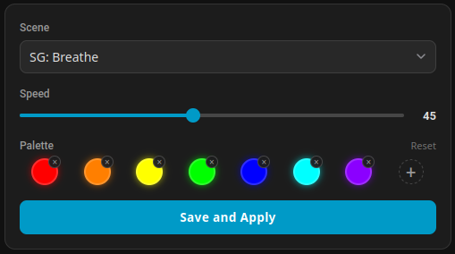
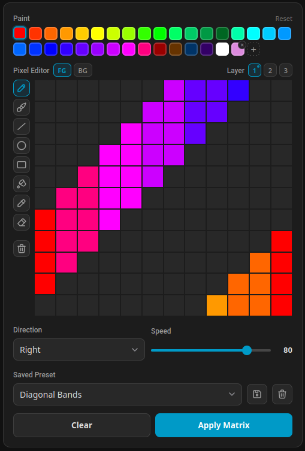

# Govee LAN Home Assistant Integration

Custom Home Assistant integration for controlling Govee lamps over the local LAN
UDP API, with a focus on **Smart Table Lamp 2** (H6022) compatiblity for my own use.

Other device may support scene modes, but it's untested. Brightness and colour
should work fine.

## Features

- Power on/off
- Brightness
- RGB colour
- Colour temperature
- Local polling of basic device state
- Scene/effect activation when Govee scene metadata is available for the model
- H6022: Customisable DIY effects (simple mode) - breathe, dream, graffiti, fire, etc.
- H6022: Sound-reactive effects for supported models, including music visualiser modes
- H6022: Custom matrix scenes (animated, layers)

## Install

### Via HACS (recommended)

Add this repository as a custom repository in HACS:

1. Open HACS -> Integrations -> Custom repositories (three-dot menu)
2. Enter the repository URL and select **Integration** as the category
3. Install **Govee LAN** and restart Home Assistant

### Manual

Copy `custom_components/govee_lan` into your Home Assistant config directory:

```text
/config/custom_components/govee_lan
```

Restart Home Assistant, then add the integration from:

```text
Settings -> Devices & services -> Add integration -> Govee LAN
```

The setup flow scans the LAN for compatible lamps and lets you choose one. If
discovery does not find the lamp, select manual setup and enter the lamp's local
IP address and SKU/model, for example `H6022`.

If another Govee LAN controller such as `govee2mqtt` is running on the same
host, it may already be using UDP port 4002. In that case discovery/status
polling cannot work at the same time. Use manual setup with "Skip connection
test" enabled; the integration will run in assumed-state mode and still send
control commands to the lamp.

Auto-discovered devices will follow IP address changes. If a manual address is
used, you should assign it a fixed one on your router.

## Requirements

Enable LAN control for the lamp in the Govee app first. The lamp and Home
Assistant must be on the same network, and UDP ports 4002 and 4003 need to be
reachable between Home Assistant and the lamp.

## Scene control

Scene effects are available through the light entity's effect dropdown, grouped into four categories:

| Prefix | Source |
|---|---|
| *(none)* | Standard Govee scene library, loaded from Govee's metadata and cached per model |
| `SG:` | Built-in animated effects from the simple scene generator (see below) |
| `Music:` | Sound-reactive/music visualiser modes |
| `Matrix:` | Custom multi-layer animated scenes you've designed |

## Simple scene generator

The integration exposes 11 built-in animation effects (prefixed `SG:`) directly
in the light entity's effect dropdown alongside the standard scene library:

| Effect | Description |
|---|---|
| SG: Breathe | Colour cycling with brightness ramp |
| SG: Gradient | Colour cycling with fixed brightness |
| SG: Fire | Flickering flames |
| SG: Rainbow | Diagonal moving rainbow |
| SG: Dream 1, 2 | Rising or falling blobs (lava lamp-like) |
| SG: Graffiti 1-4 | Various spray patterns |
| SG: Gleam | Layered fading coloured blobs |

Select any `SG:` effect from the light card and it activates immediately using
the default rainbow palette at speed 50.

For full control over colours and speed, call the `govee_lan.set_simple_scene`
service:

```yaml
service: govee_lan.set_simple_scene
target:
  entity_id: light.govee_lamp
data:
  scene: "SG: Breathe"
  speed: 30          # 0-100, default 50
  colors:            # 1-8 [R, G, B] entries; omit for rainbow default
    - [255, 0, 0]
    - [0, 0, 255]
```

### Custom scene card

`Govee Scene Card` is a custom Lovelace card with a scene picker, speed
slider, and interactive colour palette editor (up to 8 swatches).



```yaml
type: custom:govee-scene-card
entity: light.govee_lamp
default_scene: "SG: Breathe"   # optional
default_speed: 50               # optional, 0-100
show_title: true
```

Click any colour swatch to open a colour picker, `x` to remove it, and `+`
to add up to 8 colours. Press Save and Apply to update the effect defaults and
apply the new scene immediately. Selecting that SG: preset in the light entity
will now use the chosen colours and speed.

## H6022 matrix scenes

For the H6022, `govee_lan.set_matrix_scene` can send a custom matrix scene from
colour groups. LED indices run from 0 to 131, with `row = index // 12` and
`col = index % 12`. First layer is on top.

```yaml
  service: govee_lan.set_matrix_scene
  target:
    entity_id: light.govee_lamp
  data:
    layers:
      - groups:
          - color: [255, 0, 0]
            leds: [0, 1, 2, 3, 12, 13, 14, 15]  # red, top layer, cols 0-1
        mode: up
        rate: 80
        level: 100
      - groups:
          - color: [0, 0, 255]
            leds: [0, 1, 2, 3, 12, 13, 14, 15, 24, 25, 26, 27]  # blue, obscured by red on overlap
        mode: twinkle
        rate: 80
        level: 100

```

### Custom matrix card

`Govee Matrix Card` is a custom Lovelace card with a pixel-based image editor for
designing new multi-layered animated scenes.



```yaml
type: custom:govee-matrix-card
entity: light.govee_lamp
default_direction: twinkle
default_speed: 80
show_title: true
```

The editor lets you create custom animations by drawing on three separate layers and
animating the movement of each layer independently. After saving, the custom scene is 
available to choose as an effect.

## Notes

Scene names are loaded from Govee's public scene metadata endpoint, then cached
in Home Assistant storage per SKU for all supported devices except H6022.

H6022 always uses a local copy that has a few fixes and additional scenes included.

## Sources

Official LAN mode documentation:
https://app-h5.govee.com/user-manual/wlan-guide

AlgoClaw Govee reverse-engineering notes:
https://github.com/AlgoClaw/Govee/blob/main/decoded/v1.2/explanation_v1.2.md

AlgoClaw model-specific parameters: 
https://github.com/AlgoClaw/Govee/blob/main/decoded/v1.2/model_specific_parameters.json

egold555 Govee reverse-engineering:
https://github.com/egold555/Govee-Reverse-Engineering/issues/11

Govee2MQTT:
https://github.com/wez/govee2mqtt
